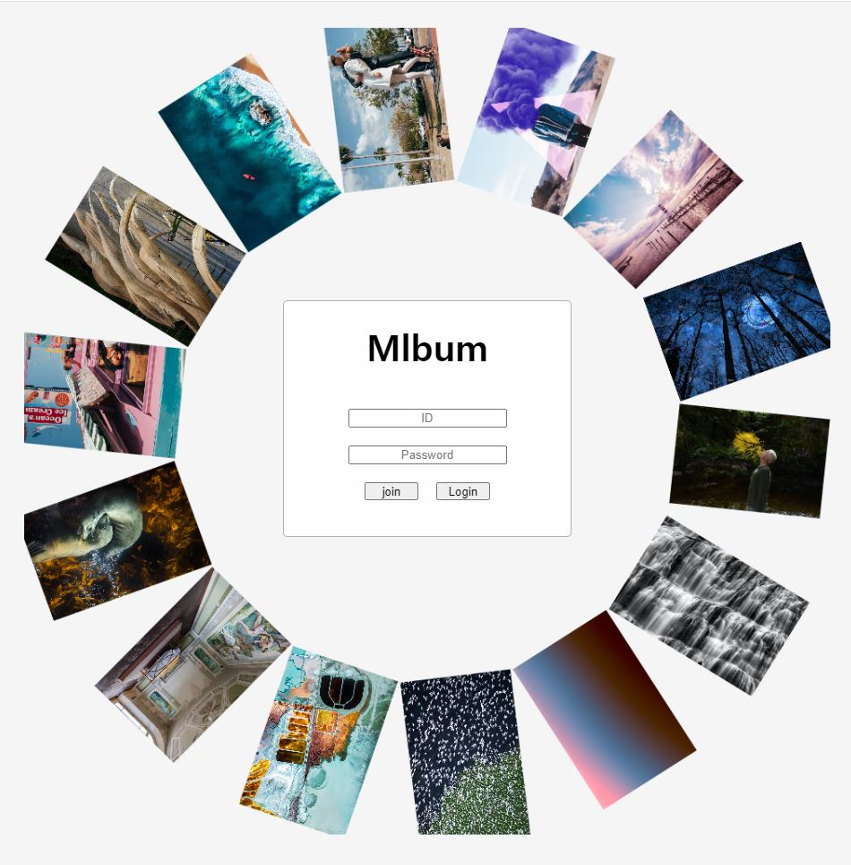
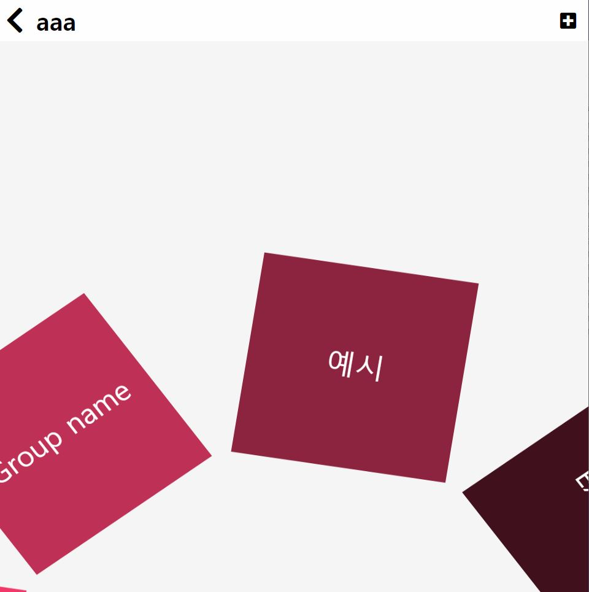
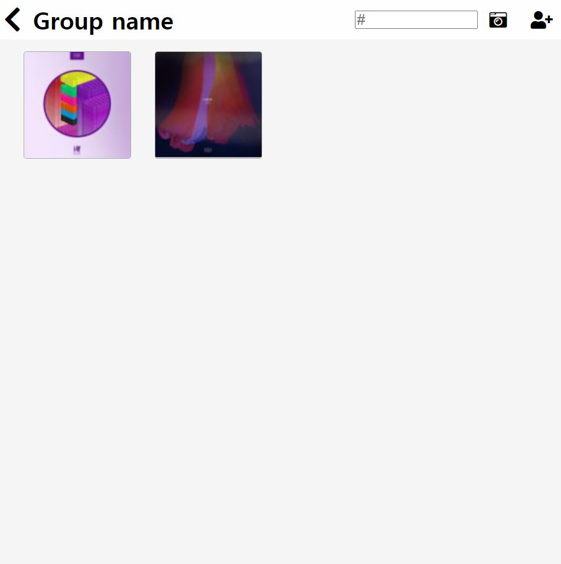

# Mlbum

---

## 프로젝트 설명

그룹으로 관리하는 사진 앨범. 

그룹에 속해있는 사람이라면 누구든지 사진을 업로드하고 삭제할 수 있다. 

## 방향

Database 학습을 위해서 CRUD 구현에 중점을 둔 프로젝트.

## 구분

- Frontend : VanilaJS + CSS + html + pug
- Backend : Nodejs
- Db : mysql

## 사용

- **babel**

        ES6 + 개발환경을 구축하여 프로젝트를 진행해보고자 시도해보았다.

- **express**

        NodeJs에서 기본적인 라우팅 등 구성이 잘 되어있어서 사용했다.

- **cookie-parser / body-parser**

        request를 보다 좋게 만들어줘서 확인하기 편하게 만들어준다.

- **morgan**

        loggin과 관련된 middleware

- **mysql**

        RDBS인 mysql을 사용하기 위해서 추가했다.

- **multer**

        파일 업로드를 위해서 추가한 middleware

## 아쉬운 점

1. webpack을 사용해보려고 했으나 시간상의 문제로 하지 못 함.
2. passport를 이용해서 Auth 부분을 구현하려 했으나 하지 못함.
3. mysql 쿼리가 더러움.

---

## 사진

### 로그인 화면

VanilaJS로 만든 원형 사진 틀.

### 개인 화면

Username : aaa

 **>**  VanilaJS로 구성하여 마우스에 움직임에 따라 회전한다.

### 그룹화면

 **>** 바둑판 배열의 형태로 사진이 추가된다.
